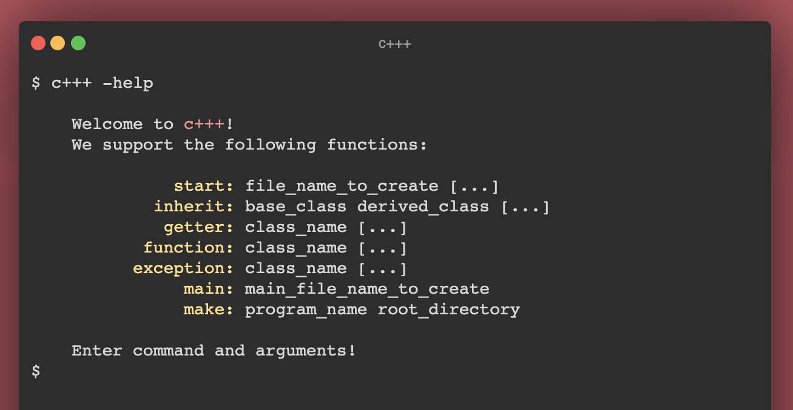
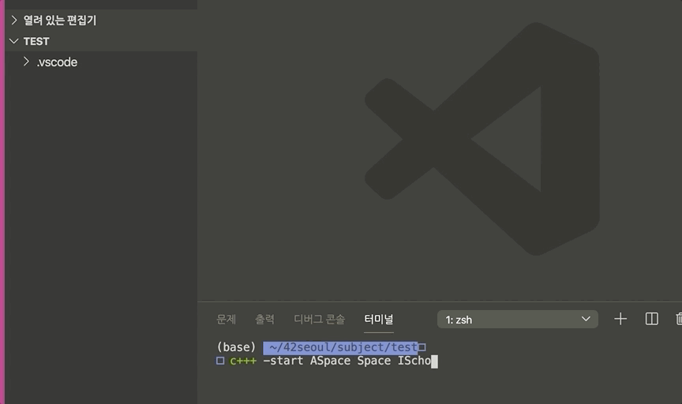

# C+++ 

**c+++** 은 c++ 코드 작성을 돕는 터미널 플러그인입니다.
mac os(10.15.6)에서 clang++ 컴파일러로 -std=c++17 플래그를 베이스로 개발하였으며,
크게 일곱 개의 기능을 가지고 있습니다.

* **캐노니컬 형식**을 따르는 템플릿이 적용된 cpp/hpp 파일을 생성합니다.
* **상속** 진행시 관계가 설정된 자식 클래스 파일을 생성합니다.
* **getter** 함수를 생성합니다.
* 헤더 파일에 생성한 **멤버 함수**를 소스 파일에 업데이트합니다.
* **exception** 생성시 필요한 보일러 플레이트 코드들을 생성합니다.
* 소스 코드를 분석하여 메인 헤더 파일과 소스 파일을 생성합니다.
* **메이크 파일**을 생성합니다.

  

# Efficiency
|                            | 👌 Support  |
| -------------------------- | :----------------: |
| 파일 생성 (.cpp, .hpp)        |         ✔️         |
| 클래스 템플릿 (.cpp)          |         ✔️         |
| 캐노니컬 폼 (.cpp, .hpp)      |         ✔️         |
| 베이스 클래스 포함             |         ✔️         |
| 상속 관계 설정                |         ✔️         |
| 가상 함수 오버로드             |         ✔️         |
| Getter 함수 (.cpp, .hpp)    |         ✔️         |
| Exception 캐노니컬 폼        |         ✔️         |
| 메인 헤더/소스파일 생성         |         ✔️         |
| 메이크 파일 생성              |         ✔️         |

다양한 기능을 통해 적은 타이핑으로 많은 시간을 아낄 수 있습니다.

# Usage

  

    git clone https://github.com/eunhyulkim/cppp.git cppp & cd cppp;
    clang++ -std=c++17 *.cpp -o c+++;
    cp c+++ ~/.c+++;
    echo "alias c+++='~/.c+++';' >> ~/.zshrc;
    source ~/.zshrc;
    c+++ -help;

Mac OS 유저라면 컴파일된 프로그램 파일을 바로 적용할 수 있습니다.

# WARNING
start, inherit, getter, exit, function, main, 그리고 make의 흐름으로 명령을 사용하는 것이 좋습니다.
적절한 흐름에 따라 사용하지 않으면 예기치 않은 문제에 맞닥뜨릴 수 있습니다.
그러나 문제가 있더라도 자체적인 복구 기능이 내장되어 있어 사용할 수 있습니다.
